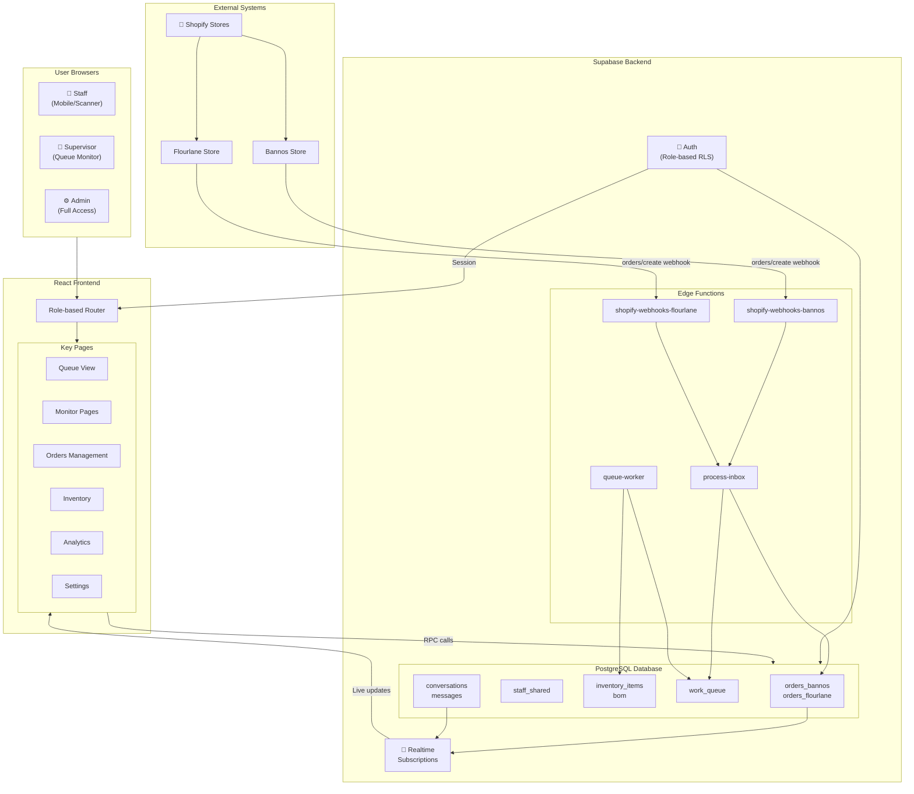
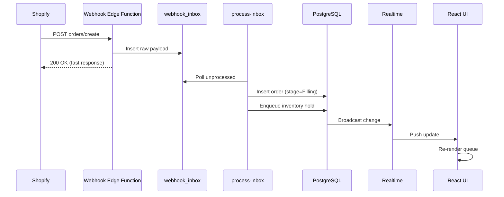
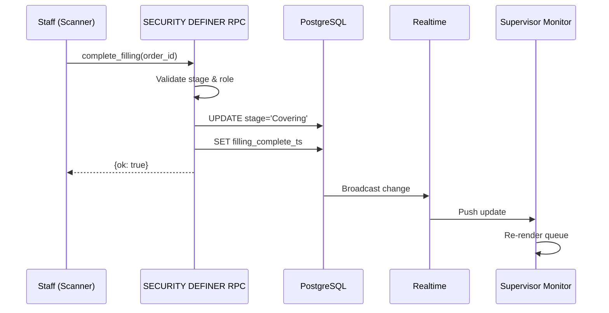

# Architecture

High-level system architecture for Ordak production management system.

## System Overview



## Data Flows

### 1. Order Ingestion (Shopify → UI)



### 2. Production Stage Transition (Scan → Update)



## Component Details

### Edge Functions

| Function | Trigger | Purpose |
|----------|---------|---------|
| `shopify-webhooks-bannos` | Shopify webhook | Receive Bannos orders |
| `shopify-webhooks-flourlane` | Shopify webhook | Receive Flourlane orders |
| `process-inbox` | Database webhook / cron | Parse orders, create records |
| `queue-worker` | Scheduled | Process inventory holds |

### Database Tables (Key)

| Table | Purpose |
|-------|---------|
| `orders_bannos` / `orders_flourlane` | Order records per store |
| `staff_shared` | Staff profiles & roles |
| `inventory_items` | Component stock levels |
| `bom` | Bill of Materials |
| `work_queue` | Async job queue |
| `conversations` / `messages` | Messaging system |

### Role Permissions

| Role | Access |
|------|--------|
| **Staff** | Own assignments, scan operations, messaging |
| **Supervisor** | All staff access + queue management, reassignment |
| **Admin** | Full access + settings, analytics, inventory |

### Frontend Pages

| Page | Primary Users | Purpose |
|------|---------------|---------|
| Queue View | Staff | Personal work queue |
| Monitor | Supervisor | Live production overview |
| Orders | Admin | Order management & search |
| Inventory | Admin | Stock & BOM management |
| Analytics | Admin | Production metrics |
| Settings | Admin | System configuration |

## Security Model

```
┌─────────────────────────────────────────────────────────────┐
│                     Frontend (Browser)                       │
│  • Anon key only (VITE_SUPABASE_ANON_KEY)                   │
│  • No direct table writes                                    │
│  • All mutations via RPC                                     │
└─────────────────────────────────────────────────────────────┘
                              │
                              ▼
┌─────────────────────────────────────────────────────────────┐
│                    Supabase Auth + RLS                       │
│  • JWT contains role claim                                   │
│  • RLS policies check (select auth.uid())                    │
│  • Row-level access control                                  │
└─────────────────────────────────────────────────────────────┘
                              │
                              ▼
┌─────────────────────────────────────────────────────────────┐
│                 SECURITY DEFINER RPCs                        │
│  • check_user_role() validates permissions                   │
│  • Business logic enforced server-side                       │
│  • Audit trail via stage_events                              │
└─────────────────────────────────────────────────────────────┘
                              │
                              ▼
┌─────────────────────────────────────────────────────────────┐
│                      PostgreSQL                              │
│  • Tables protected by RLS (no direct client writes)         │
│  • Service role used only by Edge Functions                  │
└─────────────────────────────────────────────────────────────┘
```

## Production Stage Flow

```
┌──────────┐    ┌──────────┐    ┌────────────┐    ┌─────────┐    ┌──────────┐
│ Filling  │───▶│ Covering │───▶│ Decorating │───▶│ Packing │───▶│ Complete │
└──────────┘    └──────────┘    └────────────┘    └─────────┘    └──────────┘
     │               │                │                │
     ▼               ▼                ▼                ▼
• Print barcode  • Scan start    • Scan start    • Scan start
  (starts ts)    • Scan complete • Scan complete • QC check
• Scan complete                        ▲          • Set storage
                                       │          • Print packing slip
                                       │          • Scan complete
                                       │
                                  QC Return
                               (if issues found)
```

### Stage Details

| Stage | Start Action | End Action | Timestamps |
|-------|--------------|------------|------------|
| **Filling** | Print barcode | Scan complete | `filling_start_ts`, `filling_complete_ts` |
| **Covering** | Scan start | Scan complete | `covering_start_ts`, `covering_complete_ts` |
| **Decorating** | Scan start | Scan complete | `decorating_start_ts`, `decorating_complete_ts` |
| **Packing** | Scan start | Scan complete | `packing_start_ts`, `packing_complete_ts` |
| **Complete** | - | - | `completed_at` |

### Stage Workflow Details

1. **Filling**
   - Print barcode → sets `filling_start_ts`
   - Scan complete → sets `filling_complete_ts`, advances to Covering

2. **Covering**
   - Scan start → sets `covering_start_ts`
   - Scan complete → sets `covering_complete_ts`, advances to Decorating

3. **Decorating**
   - Scan start → sets `decorating_start_ts`
   - Scan complete → sets `decorating_complete_ts`, advances to Packing

4. **Packing**
   - Scan start → sets `packing_start_ts`
   - QC check → verify decoration quality
   - Set storage location
   - Print packing slip
   - Scan complete → sets `packing_complete_ts`, advances to Complete

5. **QC Return**
   - If issues found during Packing QC check
   - Returns order from Packing → Decorating
   - Logs reason for return

### Key Points

- Each stage has assigned staff (`assignee_id`)
- "Unassigned" = `assignee_id IS NULL` (not a separate stage)
- QC can return orders from Packing → Decorating
- All transitions logged with timestamps
- RPCs are idempotent (re-scanning returns `already_done: true`)
